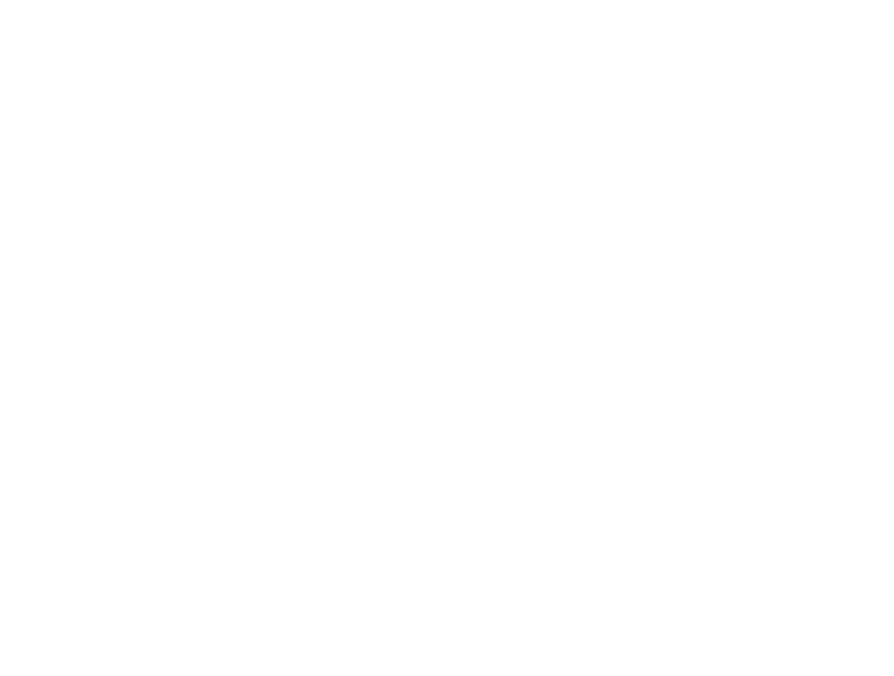
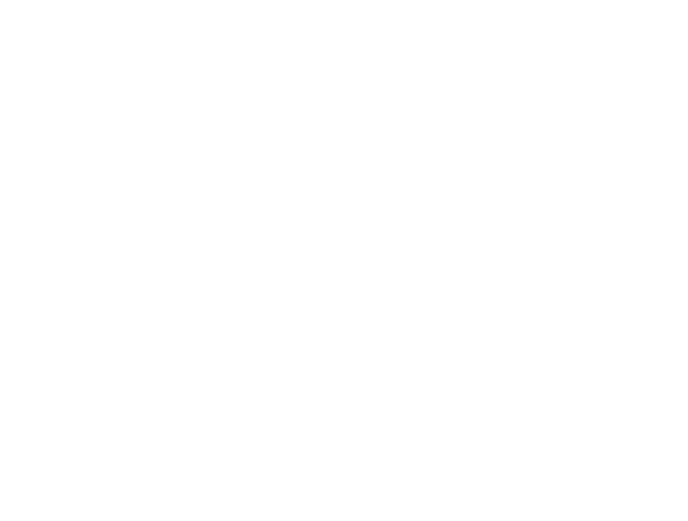
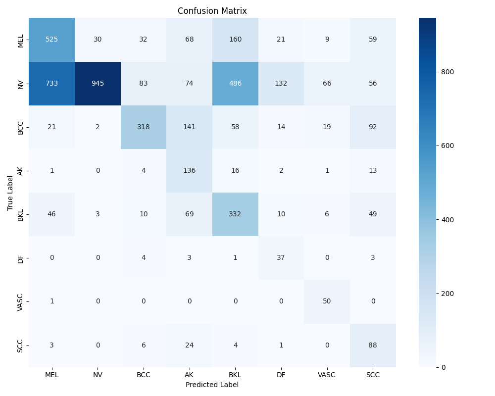

# skin_lesion_classifier# Skin Lesion Classifier

A deep learning classifier for dermoscopic skin lesion images built with PyTorch and transfer learning on the ISIC 2019 dataset.

> ⚠️ **Disclaimer:** This is a research and learning project, not a medical diagnostic tool. Do not use for clinical decision making.

---

## Overview

This project trains a convolutional neural network to classify dermoscopy images into 8 diagnostic categories using transfer learning with a pretrained ResNet50 backbone. The goal was to explore the challenges of medical image classification, particularly class imbalance and the tradeoff between precision and recall in high-stakes prediction tasks.

---

## Dataset

**ISIC 2019 Challenge Dataset**
- 25,331 dermoscopy images across 8 diagnostic categories
- Source: [ISIC Archive](https://challenge.isic-archive.com/data/#2019)
- License: CC-BY-NC

### Diagnostic Categories

| Code | Diagnosis | Type |
|------|-----------|------|
| MEL | Melanoma | Malignant |
| NV | Melanocytic Nevus | Benign |
| BCC | Basal Cell Carcinoma | Malignant |
| AK | Actinic Keratosis | Pre-cancerous |
| BKL | Benign Keratosis | Benign |
| DF | Dermatofibroma | Benign |
| VASC | Vascular Lesion | Benign |
| SCC | Squamous Cell Carcinoma | Malignant |

### Class Distribution



The dataset has severe class imbalance with NV (12,875 images) outnumbering DF (239 images) by a 54:1 ratio. This was a central challenge of the project.

---

## Sample Images by Class



Visual inspection reveals why some classes are harder than others. MEL and NV share similar dark irregular morphology while VASC has a distinctive red/purple appearance that makes it visually separable.

---

## Approach

### Model Architecture
- **Backbone:** ResNet50 pretrained on ImageNet
- **Transfer learning strategy:** Froze all layers except `layer4` and the final FC layer
- **Custom head:** `Linear(2048→256) → ReLU → Dropout(0.3) → Linear(256→8)`
- **Rationale:** Medical imagery differs significantly from ImageNet, unfreezing `layer4` allowed the model to adapt mid-level features to dermoscopic patterns

### Handling Class Imbalance
Three strategies were combined:
1. **WeightedRandomSampler** -- oversampled minority classes during training
2. **Weighted CrossEntropyLoss** -- penalized mistakes on rare classes more heavily
3. **Data augmentation** -- random flips, rotations, and color jitter on training images

### Training
- Optimizer: Adam with layer-specific learning rates (`layer4: 1e-4`, `fc: 1e-3`)
- Scheduler: ReduceLROnPlateau (patience=2, factor=0.5)
- Epochs: 5
- Batch size: 32
- Hardware: Apple Silicon MPS

---

## Results

### Overall Performance
- **Validation Accuracy:** 47.98%
- **Baseline (random guessing):** 12.5%

### Per Class Performance

| Class | Precision | Recall | F1 |
|-------|-----------|--------|----|
| MEL | 0.39 | 0.58 | 0.47 |
| NV | 0.96 | 0.37 | 0.53 |
| BCC | 0.70 | 0.48 | 0.57 |
| AK | 0.26 | 0.79 | 0.40 |
| BKL | 0.31 | 0.63 | 0.42 |
| DF | 0.17 | 0.77 | 0.28 |
| VASC | 0.33 | 0.98 | 0.50 |
| SCC | 0.24 | 0.70 | 0.36 |

### Confusion Matrix



### Key Findings

**Strengths:**
- VASC achieved 98% recall due to its visually distinctive appearance
- NV precision of 96% means very few false melanoma alarms on moles
- Model learned meaningful class separation well above random baseline

**Limitations:**
- MEL recall of 58% means 42% of melanomas were missed, unacceptable for clinical use
- High confidence predictions were not always correct, indicating poor model calibration
- NV recall of 37% reflects the difficulty of the dominant class under imbalanced sampling

**Clinical tradeoff:**
In cancer screening, recall matters more than precision. A missed melanoma is far more dangerous than a false alarm. The current MEL recall of 58% would need to reach 90%+ before this model could be considered for any assistive clinical role.

---

## Project Structure

---

## Usage

### Setup
```bash
git clone https://github.com/drtclem/skin-lesion-classifier.git
cd skin-lesion-classifier
python -m venv venv
source venv/bin/activate
pip install -r requirements.txt
```

### Train
```bash
cd src
python train.py
```

### Evaluate
```bash
cd src
python evaluate.py
```

### Demo
```bash
python demo.py path/to/image.jpg
```

---

## Future Improvements

- **Longer training:** 20+ epochs with cosine annealing scheduler
- **Larger backbone:** ResNet101 or EfficientNet for higher capacity
- **Confidence thresholding:** Flag low confidence predictions for human review rather than forcing a classification
- **Better augmentation:** Class specific augmentation strategies for minority classes
- **Ensemble modeling:** Combine multiple model checkpoints to improve stability

---

## Tech Stack


---

*Taylor Clements, PhD*